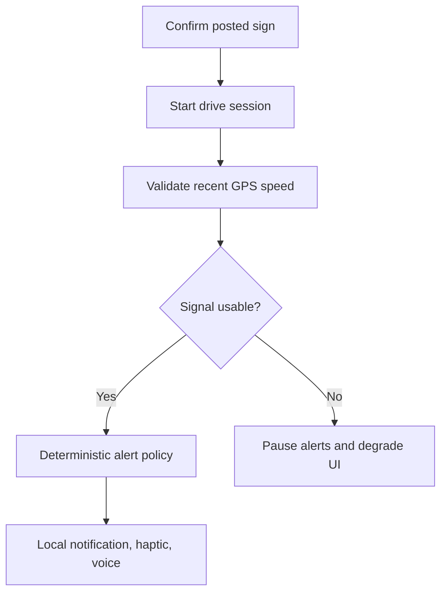

# RoadLimit UAE

Privacy-first, open-source speed awareness for Android and iPhone. Dubai-first research beta; not store-ready.

> **Safety first:** This independent driver-awareness aid is not a government service, navigation authority, radar detector, or guarantee against fines. Always obey the posted and temporary signs, police directions, and applicable law. A radar-control value is an enforcement setting—not permission to exceed the posted limit. Set up only while parked and never handle the phone while driving.

## What works today

- One React Native + Expo SDK 57 codebase for Android and iOS.
- Live GPS speed with recent-fix validation and median smoothing.
- An explicit posted-limit confirmation before every drive session.
- A manual sign mode that works offline and needs no account, API key, or map.
- A small parked road-reference catalog; the driver still confirms the physical sign.
- User-started background sessions, local notifications, haptics, and foreground voice.
- Approaching-limit and at-limit alerts with cooldown and hysteresis.
- No ads, analytics, trip history, coordinate persistence, or route upload.

The live alert loop is deterministic. No LLM or AI model decides a speed limit.

## Why this is an app, not only a ChatGPT skill

A ChatGPT skill can answer sourced questions while parked, but it is not the right runtime for continuous precise GPS and locked-screen alerts. OpenAI's plugin guidance also says plugins should not request precise GPS directly. RoadLimit keeps the safety loop on the phone.

## How limits work

| Mode | Network/key | Behaviour |
|---|---:|---|
| Confirm the sign | None | Select the displayed limit, then explicitly confirm it again when starting. Recommended. |
| Road reference | None | Pick a source-linked candidate while parked, then confirm the exact signed value for the current section. |

The beta intentionally does **not** infer the road or speed limit from GPS. The available official table has road names and values but no segment geometry or direction, and several named roads contain multiple limits. Guessing would be unsafe. A future automatic mode needs licensed geometry, current segment-level rules, confidence gating, and field validation.

Radar-control numbers are never used for alerts or shown as a driving target. The app never assumes a “+20 km/h” allowance.

## Quick start

Prerequisites: Node.js 22+, Android Studio or Xcode, and an Expo development build.

```bash
npm install
npx expo prebuild
npx expo run:android
# or: npx expo run:ios
```

Background location is not supported adequately in Expo Go. Test with a development or release build on a physical device.

## Platform reality

| Behaviour | Android | iOS |
|---|---|---|
| Active-session background tracking | Foreground location service and persistent notification | `Always` location and visible background-location indicator |
| Screen locked / another app open | Supported subject to OS/OEM controls | Supported subject to iOS controls |
| Notification permission denied | Falls back to screen-open mode | Falls back to screen-open mode |
| After force-stop or reboot | Reopen and restart; never auto-starts | Reopen and restart; never auto-starts |
| Voice in silent/Focus mode | May be suppressed | May be suppressed; Expo Speech is silent on physical iPhones in silent mode |

The UI marks delayed or unusable GPS as **Signal degraded**, clears current speed, and pauses speed alerts. Background mode requires a local-notification channel; otherwise the app uses clearly labelled screen-open mode.

## Data: the hard part

The linked Emirates 24|7 article is a secondary summary, not a geospatial feed. The official Dubai list has road names, posted speeds, and radar controls, but no segment coordinates or directions. Multiple values can apply to the same named road.

This repository therefore does **not** copy the full article table. It bundles four transparent demonstration references only. Production data should include:

- road-segment geometry, carriageway, and direction;
- legal posted limit, validity dates, and confidence;
- a current primary source and verification date;
- aliases and route references;
- explicit licence/redistribution permission;
- review for changed, temporary, and conflicting values.

The [Dubai Pulse dataset](https://www.dubaipulse.gov.ae/data/dp-traffic/dp_speed_and_radar_limits-open) is labelled open data, but its metadata currently shows no specific licence. Confirm the applicable terms before redistributing it. The local importer must only be used with data you are authorised to use:

```bash
npm run data:import -- licensed-source.csv \
  --source-url https://example.org/licensed-road-data.csv \
  --license CC-BY-4.0 \
  --output local-data/review.json
```

The importer rejects missing/placeholder licence metadata and outputs outside the git-ignored `local-data/` directory. Each artifact records the HTTPS source URL, licence or written-permission identifier, input filename, and SHA-256 checksum, and remains marked unverified. A checksum proves which bytes were reviewed; it does not grant redistribution rights. Imported output is not runtime-ready until geometry, provenance, freshness, and licence are reviewed.

## Architecture



Important modules:

- `src/background/locationTask.ts` — top-level background-task registration.
- `src/services/driveEngine.ts` — session-gated processing and alert delivery.
- `src/core/alertPolicy.ts` — posted-limit thresholds, cooldown, and hysteresis.
- `src/core/speed.ts` — stale/poor-fix rejection and speed smoothing.
- `src/data/demoRoads.ts` — small cited demonstrator, not a complete database.

## Validation

```bash
npm run typecheck
npm test
npm run check
```

Tests cover speed conversion/smoothing, missing and stale GPS speed, alert transitions, cooldown, road-name matching, and data invariants. These checks support research development; they are not store-release approval.

## Research-beta and store-release gates

Do not present this beta as a production navigation authority or publish it to an app store until all of these gates have documented evidence:

- locked-screen and background tests on real Pixel, Samsung, Oppo, and iPhone devices, including silent mode, Focus, Bluetooth, battery saver, callback loss, force-stop, reboot, and permission downgrades;
- a fail-visible review of notification delivery, stale GPS behaviour, session shutdown, and platform/OEM limitations;
- a signed release-build review of generated Android and iOS permissions, background modes, backup settings, and privacy manifests;
- a public, versioned privacy-policy URL whose statements match the shipped binary and completed Apple/Google privacy disclosures;
- legal and provenance approval for every bundled road-data record, with no unspecified-licence dataset included;
- a production-bundle dependency audit and complete third-party notices, starting with [THIRD_PARTY_NOTICES.md](THIRD_PARTY_NOTICES.md); and
- accessibility, driver-distraction, regulatory, and field validation by qualified reviewers in every intended jurisdiction.

## Privacy

Coordinates are read from each location callback and discarded; they are never persisted or uploaded. Only recent speed, accuracy, and timestamp values are buffered on-device for smoothing and cleared on Stop or interrupted-session recovery. See [PRIVACY.md](PRIVACY.md).

## Sources

- [Dubai Police — Street Speed Limits](https://www.dubaipolice.gov.ae/app/home/information/street-speed-limits)
- [Dubai Pulse — Speed and Radar Limits dataset](https://www.dubaipulse.gov.ae/data/dp-traffic/dp_speed_and_radar_limits-open)
- [RTA — Smart Drive](https://www.rta.ae/wps/portal/rta/ae/home/smart-apps/app-details/smart%2Bdrive/rta%2Bsmart%2Bdrive)
- [Expo Location](https://docs.expo.dev/versions/latest/sdk/location/)
- [Expo TaskManager](https://docs.expo.dev/versions/latest/sdk/task-manager/)
- [UAE traffic legislation](https://uaelegislation.gov.ae/en/legislations/2598)

The linked [Emirates 24|7 article](https://www.emirates247.com/uae-guide/dubai-radar-limits-explained-complete-list-of-road-speed-limits-and-radar-control-speeds/4592) was used for discovery and cross-checking, not copied as a database.

## Contributing and security

Read [CONTRIBUTING.md](CONTRIBUTING.md) before proposing a road correction. Never collect evidence while driving; a parked passenger should verify the sign. Report security problems privately as described in [SECURITY.md](SECURITY.md).

Code is licensed under Apache-2.0. Road data and third-party sources have separate terms—see [DATA_LICENSE.md](DATA_LICENSE.md) and [THIRD_PARTY_NOTICES.md](THIRD_PARTY_NOTICES.md). This project is not affiliated with or endorsed by Dubai Police, RTA, Digital Dubai, Emirates 24|7, or any UAE government entity.
